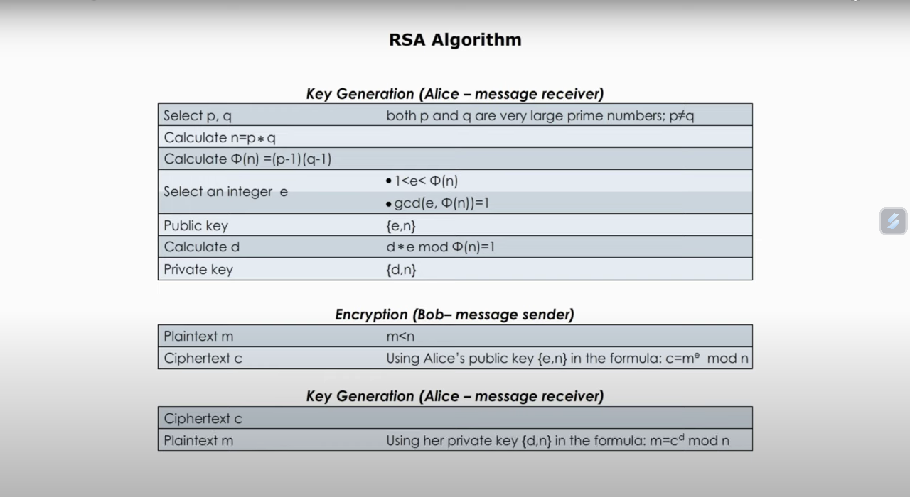

## Public key distribution of secret keys

## RSA Algorithm

## Reference

https://www.askpython.com/python/examples/rsa-algorithm-in-python

https://www.youtube.com/watch?v=AcOUdbRB7pY

https://www.youtube.com/watch?v=9EKdIZHZbG4&t=297s